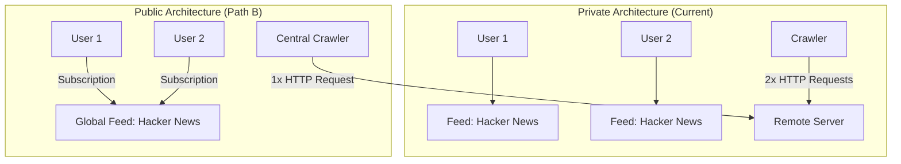
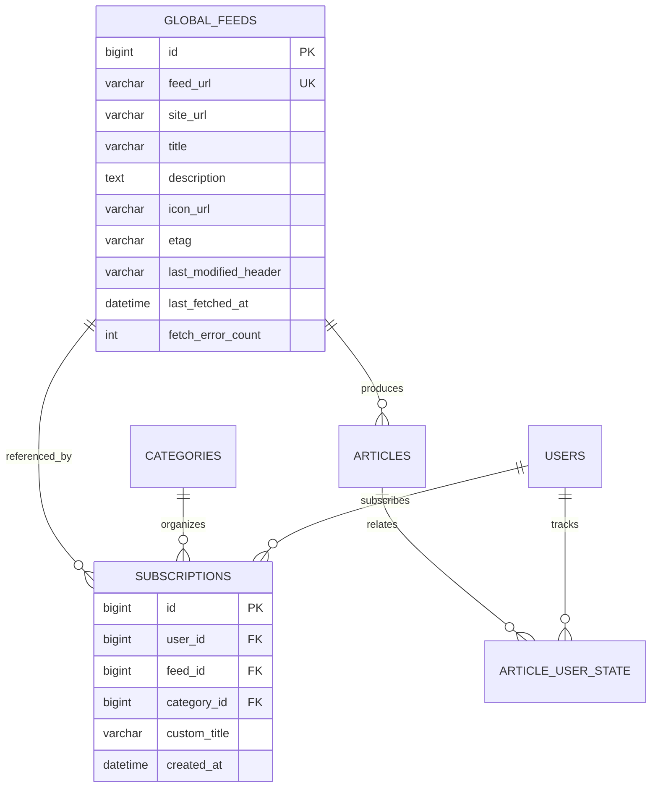

# Architecture Plan: Expanding Marginalia to a Public Multi-User Service

This document outlines the architectural roadmap, database schema migrations, and crawler enhancements required if Marginalia evolves from a private, whitelist-protected RSS reader into a public service where any user can register and subscribe to feeds.

---

## 1. Architectural Overview

Marginalia's current architecture already isolates user data via foreign keys (`user_id`) on categories, read states, and sessions. However, transitioning from a private instance (1–500 users) to a public service (thousands of users) requires decoupling feed ingestion from individual user accounts to ensure resource efficiency.



---

## 2. Step-by-Step Implementation Roadmap

### Phase 1: Authentication (Open Registration Toggle)

The authentication layer is already prepared for open registration.

#### Changes:
1. Add configuration property in `application.yml`:
   ```yaml
   app:
     auth:
       allow-public-registration: ${ALLOW_PUBLIC_REGISTRATION:false}
   ```
2. In [`CustomOAuth2UserService`](file:///Users/nobu/ghq/github.com/nobudev7/marginalia/backend/src/main/java/com/nobudev/marginalia/service/CustomOAuth2UserService.java) and [`CustomOidcUserService`](file:///Users/nobu/ghq/github.com/nobudev7/marginalia/backend/src/main/java/com/nobudev/marginalia/service/CustomOidcUserService.java):
   ```java
   if (!allowPublicRegistration && !whitelistService.isWhitelisted(email)) {
       throw new OAuth2AuthenticationException(
           new OAuth2Error("access_denied", "Registration is restricted", null)
       );
   }
   ```
   When `allow-public-registration` is set to `true`, any visitor with a valid Google or GitHub account is automatically registered on first login.

---

### Phase 2: Feed Deduplication (Decoupling Feeds & Subscriptions)

In the current private schema, each user owns distinct `feeds` rows. If 1,000 public users subscribe to the same blog, the crawler would redundantly fetch and store that blog 1,000 times every 15 minutes.

#### Proposed Database Schema Migration:

Split `feeds` into a **Global Feed Store** and a **User Subscription Mapping**:



#### Flyway Migration Script Outline (`V4__global_feed_deduplication.sql`):
```sql
-- 1. Create global feeds table
CREATE TABLE global_feeds (
    id BIGINT AUTO_INCREMENT PRIMARY KEY,
    feed_url VARCHAR(1024) NOT NULL,
    site_url VARCHAR(1024),
    title VARCHAR(255) NOT NULL,
    description TEXT,
    icon_url VARCHAR(1024),
    etag VARCHAR(255),
    last_modified_header VARCHAR(255),
    last_fetched_at DATETIME NULL,
    fetch_error_count INT NOT NULL DEFAULT 0,
    created_at DATETIME NOT NULL DEFAULT CURRENT_TIMESTAMP,
    updated_at DATETIME NOT NULL DEFAULT CURRENT_TIMESTAMP ON UPDATE CURRENT_TIMESTAMP,
    CONSTRAINT uk_global_feeds_url UNIQUE (feed_url(500))
) ENGINE=InnoDB DEFAULT CHARSET=utf8mb4 COLLATE=utf8mb4_unicode_ci;

-- 2. Create user subscriptions join table
CREATE TABLE subscriptions (
    id BIGINT AUTO_INCREMENT PRIMARY KEY,
    user_id BIGINT NOT NULL,
    feed_id BIGINT NOT NULL,
    category_id BIGINT NULL,
    custom_title VARCHAR(255),
    created_at DATETIME NOT NULL DEFAULT CURRENT_TIMESTAMP,
    CONSTRAINT fk_sub_user FOREIGN KEY (user_id) REFERENCES users(id) ON DELETE CASCADE,
    CONSTRAINT fk_sub_feed FOREIGN KEY (feed_id) REFERENCES global_feeds(id) ON DELETE CASCADE,
    CONSTRAINT fk_sub_category FOREIGN KEY (category_id) REFERENCES categories(id) ON DELETE SET NULL,
    CONSTRAINT uk_user_feed UNIQUE (user_id, feed_id),
    INDEX idx_sub_user (user_id),
    INDEX idx_sub_category (category_id)
) ENGINE=InnoDB DEFAULT CHARSET=utf8mb4 COLLATE=utf8mb4_unicode_ci;
```

#### Key Benefit:
Regardless of how many thousands of users subscribe to a popular site (e.g. BBC, The Verge, or Ars Technica), the background crawler only issues **one single HTTP conditional GET** per crawl interval.

---

### Phase 3: Background Crawler Scalability

For a personal instance, sequential or basic virtual-thread crawling is sufficient. For 50,000+ public feeds, the crawler must protect both system resources and target feed hosts:

#### 1. Per-Domain Rate Limiting & Politeness
* Problem: If 500 feeds are hosted on `substack.com`, launching 500 simultaneous requests to Substack will result in HTTP 429 (Too Many Requests) or IP bans.
* Solution: Extract the hostname (`URI.create(feedUrl).getHost()`) and throttle requests so no more than 2–4 concurrent connections touch the same domain simultaneously.

#### 2. Crawler Queue Architecture
* Introduce a lightweight Redis or database work queue:
  ```java
  // Ingest feeds whose last_fetched_at is older than their refresh interval
  Page<GlobalFeed> dueFeeds = feedRepository.findDueForFetch(PageRequest.of(0, 100));
  ```
* Virtual thread dispatchers fetch and parse batches with a 15-second connect timeout and 30-second read timeout.

---

### Phase 4: Storage Retention & Automated Pruning

In a public service with hundreds of thousands of articles ingested monthly, full-text storage will quickly consume disk space.

#### Automated Retention Task:
Add a daily maintenance scheduled job:

```java
@Scheduled(cron = "0 0 3 * * *") // Daily at 3:00 AM
@Transactional
public void purgeStaleArticles() {
    // Delete articles older than 60 days unless bookmarked (is_saved = true)
    int deleted = articleRepository.deleteStaleUnsavedArticles(LocalDateTime.now().minusDays(60));
    log.info("Article retention job pruned {} expired articles", deleted);
}
```

```sql
DELETE FROM articles
WHERE published_at < NOW() - INTERVAL 60 DAY
  AND id NOT IN (
      SELECT article_id FROM article_user_state WHERE is_saved = TRUE
  );
```

---

### Phase 5: Infrastructure & Sizing Strategy

| Deployment Tier | Registered Users | Target Hardware | Estimated Cost |
|---|---|---|---|
| **Tier 1 (Current / Private)** | 1 – 50 users | AWS Lightsail (1–2 GB RAM, 2 vCPU) | $7 – $12 / mo |
| **Tier 2 (Community / Club)** | 50 – 500 users | AWS Lightsail (4 GB RAM, 2 vCPU) | $24 / mo |
| **Tier 3 (Public SaaS)** | 500 – 10,000 users | Dedicated VPS or AWS ECS + RDS MySQL (db.t4g.medium) + Redis | $50 – $120 / mo |

---

## 3. Summary Checklist for Enabling Public Access

When you are ready to open Marginalia to the public:
1. [ ] Set `ALLOW_PUBLIC_REGISTRATION=true` in deployment environment variables.
2. [ ] Apply the Global Feed Deduplication migration (`global_feeds` + `subscriptions`).
3. [ ] Implement the daily article pruning scheduled task.
4. [ ] Configure domain-level concurrency limits in `FeedCrawlerService`.
5. [ ] Update the OAuth consent screen to Public status in Google Cloud Console.
