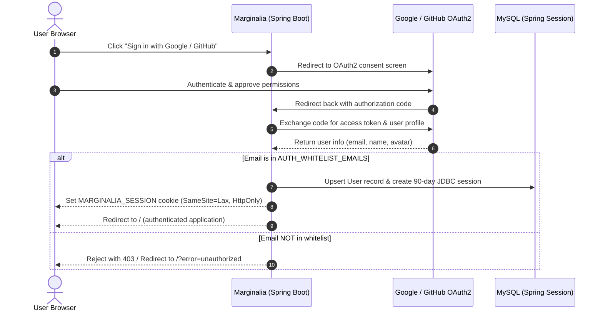

# OAuth2 Setup & Access Control Guide

This guide provides step-by-step instructions for configuring Google and GitHub OAuth2 authentication for **Marginalia**, managing the email access whitelist, and answering common questions regarding authentication architecture.

---

## 1. Overview & Architecture

Marginalia is designed as a private, self-hosted RSS reader. Instead of managing user registration forms, password hashes, and email verification infrastructure, Marginalia delegates authentication to OAuth2 providers (**Google** and **GitHub**) and strictly restricts access to an explicit **email whitelist**.



### Key Advantages of This Approach
* **Zero Password Management**: No password hashing algorithms (bcrypt/argon2), salt handling, or credential storage risks.
* **No Outbound Email Infrastructure Needed**: Avoids setting up SMTP servers, Amazon SES, or SendGrid accounts and configuring DNS records (SPF, DKIM, DMARC) for password resets or magic links.
* **Built-in Two-Factor Authentication**: Automatically benefits from whatever 2FA/MFA security you already have configured on your Google or GitHub accounts.
* **Persistent Sessions**: Sessions are saved to MySQL via Spring Session JDBC and last for **90 days**, persisting across application deployments and container restarts.

---

## 2. Google OAuth2 Setup

To allow signing in with your Google account:

### Step 1: Open Google Cloud Console
1. Navigate to the [Google Cloud Console](https://console.cloud.google.com/).
2. Create a new project (e.g. `marginalia-rss`) or select an existing one.

### Step 2: Configure the OAuth Consent Screen
1. Go to **APIs & Services** > **OAuth consent screen**.
2. Select **User Type**:
   * Choose **External** (standard for personal Google accounts).
3. Fill in the required fields:
   * **App name**: `Marginalia`
   * **User support email**: Your personal email.
   * **Developer contact information**: Your personal email.
4. On the **Scopes** page, add the following standard scopes:
   * `.../auth/userinfo.email`
   * `.../auth/userinfo.profile`
   * `openid`
5. On the **Test users** page:
   * While the app is in "Testing" mode, add your personal Google email address as an authorized test user. (Alternatively, you can publish the app to Production mode so any account on your whitelist can log in without being listed in Google's test user list).

### Step 3: Create OAuth Client ID Credentials
1. Go to **APIs & Services** > **Credentials**.
2. Click **Create Credentials** > **OAuth client ID**.
3. Set **Application type** to **Web application**.
4. **Name**: `Marginalia Web Client`.
5. **Authorized JavaScript origins**:
   * Local Development: `http://localhost:8080` (and `http://localhost:5173` if running the Vite dev server).
   * Production: `https://your-domain.com`
6. **Authorized redirect URIs**:
   * Local Development: `http://localhost:8080/login/oauth2/code/google`
   * Production: `https://your-domain.com/login/oauth2/code/google`
7. Click **Create**. Copy the **Client ID** and **Client Secret**.

---

## 3. GitHub OAuth2 Setup

To allow signing in with your GitHub account:

### Step 1: Open GitHub Developer Settings
1. Log in to GitHub and go to **Settings** > **Developer settings** > **OAuth Apps**.
2. Click **New OAuth App** (or **Register a new application**).

### Step 2: Register Application Details
1. **Application name**: `Marginalia`
2. **Homepage URL**:
   * Local Development: `http://localhost:8080`
   * Production: `https://your-domain.com`
3. **Application description**: `Personal RSS Reader`
4. **Authorization callback URL**:
   * Local Development: `http://localhost:8080/login/oauth2/code/github`
   * Production: `https://your-domain.com/login/oauth2/code/github`
5. Click **Register application**.

### Step 3: Generate Client Secret
1. On the application page, copy the **Client ID**.
2. Click **Generate a new client secret**.
3. Copy the generated **Client Secret** (note: this is only shown once).

---

## 4. Configuring Environment Variables

Marginalia reads OAuth credentials and the authorized email list from environment variables:

| Variable | Required | Description | Example |
|---|---|---|---|
| `AUTH_WHITELIST_EMAILS` | **Yes** | Comma-separated list of permitted emails | `me@gmail.com,dev@example.org` |
| `GOOGLE_CLIENT_ID` | Optional* | Google OAuth2 Client ID | `123456789-abc.apps.googleusercontent.com` |
| `GOOGLE_CLIENT_SECRET` | Optional* | Google OAuth2 Client Secret | `GOCSPX-abc123xyz` |
| `GITHUB_CLIENT_ID` | Optional* | GitHub OAuth App Client ID | `Ov23liAbCdEf12345678` |
| `GITHUB_CLIENT_SECRET` | Optional* | GitHub OAuth App Client Secret | `1234567890abcdef1234567890abcdef` |

*\*At least one provider (Google or GitHub) should be configured for production access.*

### Local Development Setup
Create a `.env` file or export the variables in your shell before running:

```bash
export AUTH_WHITELIST_EMAILS="your-email@gmail.com,your-github-email@users.noreply.github.com"
export GOOGLE_CLIENT_ID="your-google-client-id"
export GOOGLE_CLIENT_SECRET="your-google-client-secret"
export GITHUB_CLIENT_ID="your-github-client-id"
export GITHUB_CLIENT_SECRET="your-github-client-secret"

cd backend
./mvnw spring-boot:run
```

### Production Setup (Docker Compose on AWS Lightsail)
In your production `compose.yaml` (or accompanying `.env` file):

```yaml
services:
  backend:
    image: marginalia-backend:latest
    environment:
      AUTH_WHITELIST_EMAILS: "your-email@gmail.com,partner-email@example.com"
      GOOGLE_CLIENT_ID: "${GOOGLE_CLIENT_ID}"
      GOOGLE_CLIENT_SECRET: "${GOOGLE_CLIENT_SECRET}"
      GITHUB_CLIENT_ID: "${GITHUB_CLIENT_ID}"
      GITHUB_CLIENT_SECRET: "${GITHUB_CLIENT_SECRET}"
      DB_HOST: "mysql"
      DB_NAME: "marginalia"
      DB_USER: "marginalia_user"
      DB_PASSWORD: "${DB_PASSWORD}"
```

---

## 5. How to Manage Allowed Emails

### How the Whitelist Operates
* **Case-Insensitive**: `User@Gmail.com` matches `user@gmail.com`.
* **Whitespace-Tolerant**: Extra spaces between commas are automatically trimmed (`alice@example.com, bob@example.com`).
* **Instant Enforcement**: Every OAuth2 login request is evaluated against the whitelist before any user record or session is created.

### Adding a New User Later
To grant access to another email address:
1. Update `AUTH_WHITELIST_EMAILS` with the new address:
   ```bash
   AUTH_WHITELIST_EMAILS="alice@example.com,bob@example.com,newuser@example.com"
   ```
2. Restart the backend container:
   ```bash
   docker compose up -d backend
   ```
3. Have the user navigate to Marginalia and sign in with Google or GitHub. Their account will automatically be created and authorized on first login.

### Revoking Access
1. Remove the email address from `AUTH_WHITELIST_EMAILS`.
2. Restart the backend container (`docker compose up -d backend`).
3. To immediately invalidate their active session in MySQL:
   ```sql
   DELETE FROM SPRING_SESSION WHERE PRINCIPAL_NAME = 'revoked-user@example.com';
   ```

---

## 6. Frequently Asked Questions (Q&A)

### Q: Is it possible to register directly with an email and password (without Google or GitHub)?
**A: Not out of the box, by design.**

Here is the architectural rationale:
1. **Security Overhead**: Storing passwords safely requires salted slow-hashing algorithms (Argon2id or bcrypt), brute-force rate-limiting, account lockout protections, secure CSRF mitigation, and password change policies.
2. **Operational Overhead**: Email-based accounts require account verification and password reset workflows. These demand a reliable transactional email delivery service (e.g. Amazon SES, Postmark, or SendGrid), valid DNS configuration (SPF, DKIM, DMARC), and ongoing domain reputation management so emails avoid junk folders.
3. **Target Use Case**: Marginalia is a personal, private feed reader for you (and optionally a few invited family members or friends). OAuth2 delegates identity verification and multi-factor authentication to established providers with zero maintenance overhead.

If standard username/password authentication is ever desired in the future, it can be added by:
- Adding a `password_hash` column to the `users` table via a Flyway migration.
- Adding a Spring Security `DaoAuthenticationProvider` and login form endpoint.
- Integrating an SMTP / SES client for password recovery flows.

---

### Q: What happens if someone not on the whitelist tries to sign in?
**A:**
1. The user will be redirected to Google or GitHub and authenticate with their credentials.
2. When the provider redirects back to Marginalia, `CustomOAuth2UserService` / `CustomOidcUserService` checks the email against `AuthWhitelistService`.
3. Because the email is not listed in `AUTH_WHITELIST_EMAILS`, an `OAuth2AuthenticationException` (`access_denied`) is thrown.
4. Marginalia redirects the browser to `/?error=unauthorized`.
5. **No database record is created, and no session is established.**

---

### Q: What if my GitHub email is set to "Private" in my GitHub profile?
**A: It works automatically.**

Many GitHub users hide their primary email from their public profile. Standard OAuth2 queries return `null` for the `email` attribute in this case.

Marginalia's `CustomOAuth2UserService` includes a dedicated fallback:
- If the public email is null, it immediately calls the GitHub REST API (`GET https://api.github.com/user/emails`) using the user's OAuth access token.
- It finds the primary, verified email address associated with the GitHub account and validates that address against your whitelist.
- As long as your GitHub account's primary email matches your whitelist, login succeeds seamlessly.

---

### Q: How long do sessions last? Will I be logged out when the server restarts?
**A: Sessions last 90 days and survive server restarts.**

Marginalia uses **Spring Session JDBC** backed by MySQL:
- When you log in, session state is written to the `SPRING_SESSION` and `SPRING_SESSION_ATTRIBUTES` tables.
- A secure session cookie named `MARGINALIA_SESSION` is set in your browser with a `Max-Age` of 90 days (`7,776,000` seconds), `SameSite=Lax`, and `HttpOnly`.
- Because session records reside in MySQL rather than server RAM, restarting the Spring Boot backend, updating containers, or rebooting the Lightsail instance will **not** invalidate your session. You stay logged in across desktop and mobile devices.

---

### Q: Can I sign in with either Google or GitHub using the same email?
**A: Yes.**

Marginalia indexes users uniquely by email address (`users.email` unique constraint). If your Google account (`you@example.com`) and your GitHub account (`you@example.com`) share the same address, signing in through either button will resolve to the exact same user account, subscriptions, read states, and bookmarks.

---

### Q: What if I only want to configure Google and ignore GitHub (or vice versa)?
**A: Simply leave the other provider's credentials unset.**

If `GITHUB_CLIENT_ID` and `GITHUB_CLIENT_SECRET` are not set, GitHub login will not be active, but Google login will continue functioning normally. The frontend inspects `/api/auth/providers` to show only the configured sign-in buttons.

---

## 7. Local Development Authentication (`/api/auth/dev-login`)

During local development and testing, you may want to test feed subscriptions, crawling, OPML import/export, and article bookmarking without needing to configure Google Cloud or GitHub OAuth applications first.

Marginalia includes a local helper endpoint at `/api/auth/dev-login`.

### How It Works
* **Endpoint**: `GET` or `POST` `/api/auth/dev-login?email=<email>` (defaults to `test@example.com`)
* **Behavior**:
  1. Finds or creates the `User` in the database.
  2. Injects an authenticated `ROLE_USER` principal into Spring Security's context.
  3. Creates an active session in the MySQL `SPRING_SESSION` table.
  4. Returns the `Set-Cookie: MARGINALIA_SESSION=...` header in the HTTP response.

### What It Validates vs. What Requires Real OAuth2

| Capability | Validated by `dev-login` | Requires Real OAuth2 |
|---|:---:|:---:|
| **Spring Security session filter** (accepts valid cookie, rejects unauthenticated requests with 401) | **Yes** | **Yes** |
| **Spring Session JDBC persistence** (saving sessions in MySQL for 90 days) | **Yes** | **Yes** |
| **User context resolution** (`UserService.getCurrentUser()` isolates data per user) | **Yes** | **Yes** |
| **Feed CRUD, live crawling, OPML import/export, and unread counts** | **Yes** | **Yes** |
| **External Google/GitHub handshake** (redirects, user consent screen, 2FA) | No | **Yes** |
| **Live email verification** (checking that the user actually owns that email address) | No | **Yes** |

### Usage Examples

#### In Your Browser
Open:
```
http://localhost:8080/api/auth/dev-login?email=test@example.com
```
Your browser stores the session cookie. You can now immediately view protected API endpoints (such as `http://localhost:8080/api/feeds` or `http://localhost:8080/api/articles`) directly in the browser.

#### In Terminal (`curl`)
Save the session cookie to a local file (`cookies.txt`):
```bash
curl -c cookies.txt "http://localhost:8080/api/auth/dev-login?email=test@example.com"
```
Use that cookie for subsequent requests:
```bash
curl -b cookies.txt "http://localhost:8080/api/articles?size=5"
```

### Production Safeguard
This endpoint is guarded by the `app.auth.dev-mode` property in `backend/src/main/resources/application.yml`:
```yaml
app:
  auth:
    dev-mode: ${DEV_MODE:false}
```
By default, the endpoint is **completely disabled and returns `404 Not Found`**. For local development, dev-mode can be enabled either by setting the environment variable `DEV_MODE=true` or by activating the `dev` profile (`application-dev.yml`). In production environments without explicit configuration, the application fails closed.

For detailed instructions on activating the `dev` profile via CLI, environment variables, or IDE settings, see the [Local Development Guide](local-development-guide.md).


